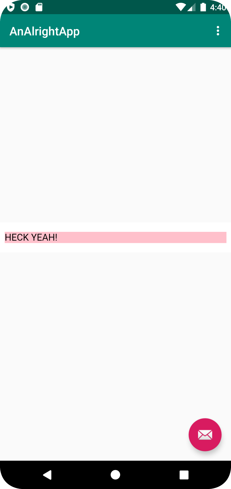

# Rapport

I denna uppgift så byttes namnet på appen. Text-rutan på hemskärmen byttes till en webview, som sen visade upp två olika hemsidor beroende på om man valde Internal eller External Web Page i menyn högst upp till höger. Den externa sidan använde en vanlig URL och den interna sidan kopplade till en HMTL-fil i projektet. För att allt skulle fungera fick appen även tillgång till internet.

Den nya WebView-n:
```
<WebView
        android:id="@+id/my_webview"
        android:layout_width="wrap_content"
        android:layout_height="wrap_content"
        app:layout_constraintLeft_toLeftOf="parent"
        app:layout_constraintRight_toRightOf="parent"
        app:layout_constraintTop_toTopOf="parent"
        app:layout_constraintBottom_toBottomOf="parent"
        />
```

WebView-n fick en variabel i java kopplades ihop med en WebViewClient:
```
    private WebView myWebView;
    private WebViewClient myWebClient;
```
```
    ...
    myWebView = findViewById(R.id.my_webview); // add webview from content_main
    myWebView.setWebViewClient(myWebClient); // set webclient to show urls in app

    myWebView.getSettings().setJavaScriptEnabled(true); // enable java in webview
    ...
```
Den externa sidan:


Den interna sidan:
